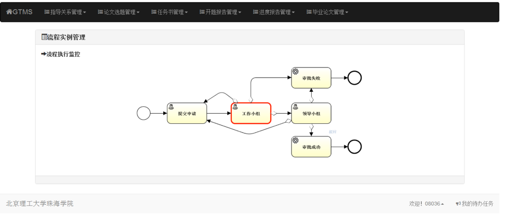

# Thesis Management System

Graduation Thesis Management System (GTMS) is based on the thesis regulation of Beijing Institute of Technology, Zhuhai Campus and is developed according to the practical requirements. The files used to be managed by hand so that the management efficiency was unsatisfactory. Moreover, it was unscientific. Therefore, GTMS can maximize work efficiency and facilitate the improvement of the thesis management.

## Built With

The system is based on B/S. More importantly, it is suitable for various device screen. Project is built by **Maven3**. The structure is based on the technology of **Boostrap3, struts2, spring3 and hibernate4 and workflow engine named Activiti5**. The primary functions include security module, system management module and thesis management module. The most amazing future is that the system is flexible and maintainable thereby developing new function with workflow in a short time.  

## Quick Workflow Demo 

Key words: workflow engine, flexible system  
